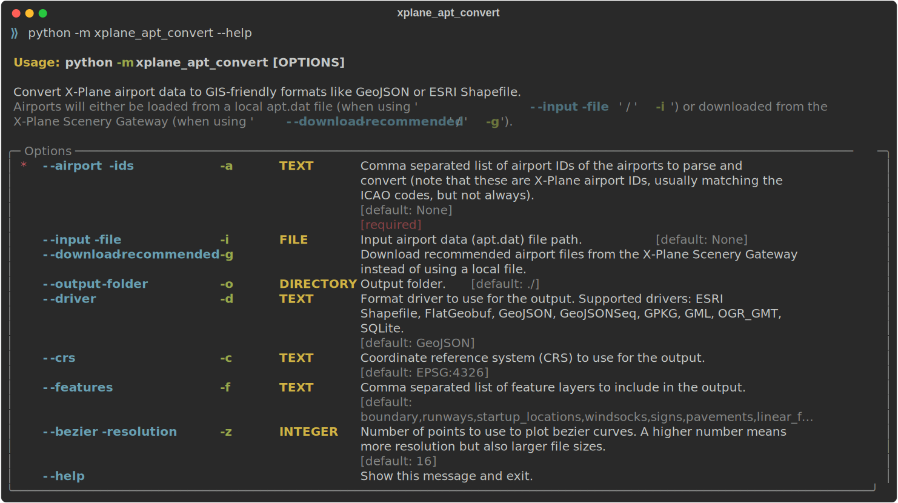

# X-Plane apt.dat convert

Convert X-Plane airport data to GIS-friendly formats like GeoJSON or ESRI Shapefile.

## Usage Examples

Convert an airport in a local `apt.dat` file to GeoJSON:

```console
python -m xplane_apt_convert -a LEBL -i ./apt.dat -o ./out/ -d GeoJSON
```

Convert multiple airports:

```console
python -m xplane_apt_convert -a LEBL,LEGE,LERS,LELL -i ./apt.dat -o ./out/ -d GeoJSON
```

Download the recommended airport data files from the X-Plane Scenery Gateway and convert them:

```console
python -m xplane_apt_convert -a LEBL,LEGE,LERS,LELL -g -o ./out/ -d GeoJSON
```

Other output file formats are available using the `-d` option, for example `GeoJSON`, `ESRI Shapefile`, or `GPKG`.

