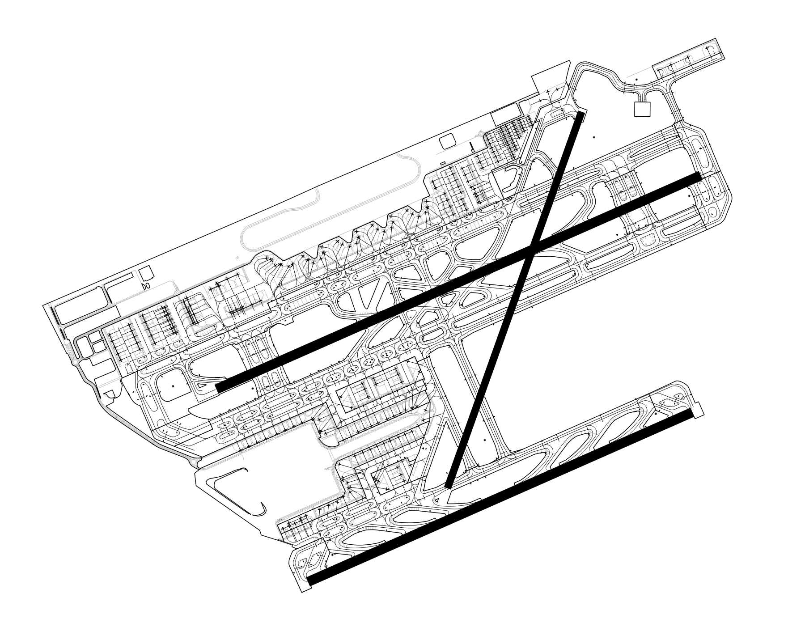
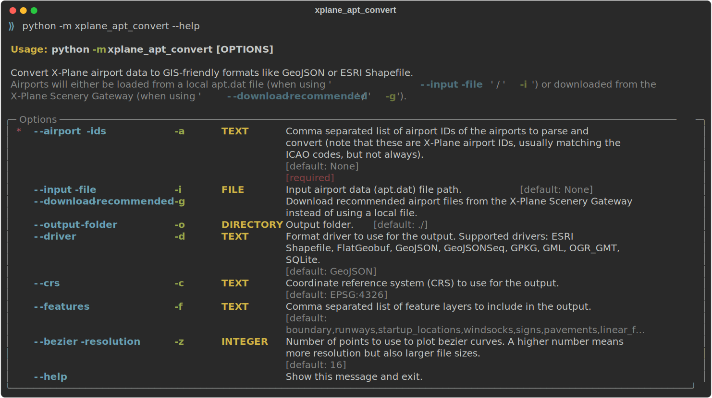

# X-Plane apt.dat convert

Convert X-Plane airport data to GIS-friendly formats like GeoJSON or ESRI Shapefile.

[](https://raw.githubusercontent.com/CarlosBergillos/xplane_apt_convert/main/images/example_LEBL.png)

**Note:** It has only been tested with `apt.dat` files with version 1100.

## Supported Output Formats

| Format                     | Extension   |
| :------------------------- | :---------- |
| ESRI Shapefile             | `.shp`      |
| FlatGeobuf                 | `.fgb`      |
| GeoJSON                    | `.geojson`  |
| GeoJSON lines (GeoJSONSeq) | `.geojsonl` |
| GeoPackage (GPKG)          | `.gpkg`     |
| GML                        | `.gml`      |
| OGR_GMT                    | `.gmt`      |
| SQLite                     | `.sqlite`   |


## Supported Features

- **Windsocks** (row code `19`)
- **Ground signs** (row code `20`)
- **Runways** (row code `100`)
- **Pavement areas (taxiway and aprons)** (header row code `110`)
- **Ground markings (linear features)** (header row code `120`)
- **Airport boundary** (header row code `130`)
- **Aircraft startup locations (parking and gates)** (row code `1300`)
- **Airport metadata** (row code `1302`)


## CLI Basic Usage

Convert an airport in a local `apt.dat` file to GeoJSON:

```console
python -m xplane_apt_convert -a LEBL -i ./apt.dat -o ./out/ -d GeoJSON
```


Convert multiple airports:

```console
python -m xplane_apt_convert -a LEBL,LEGE,LERS,LELL -i ./apt.dat -o ./out/ -d GeoJSON
```


Download the recommended airport data files from the X-Plane Scenery Gateway and convert them:

```console
python -m xplane_apt_convert -a LEBL,LEGE,LERS,LELL -g -o ./out/ -d GeoJSON
```

Other output file formats are available using the `-d` option, for example `GeoJSON`, `ESRI Shapefile`, or `GPKG`.

For information about all available options run the command using `--help`.

[](https://raw.githubusercontent.com/CarlosBergillos/xplane_apt_convert/main/images/cli_help.svg)


## Python Basic Usage

Convert an airport in a local `apt.dat` file to GeoJSON:

```python
from xplane_airports.AptDat import AptDat

with open(input_file, "r") as f:
    apt_dat = AptDat.from_file_text(f.read(), input_file)

apt = apt_dat.search_by_id(airport_id)

p_apt = ParsedAirport(apt)
p_apt.export("./aiport.geojson")
```


Download an airport from the X-Plane Scenery Gateway and convert it to ESRI Shapefile:

```python
from xplane_airports.gateway import scenery_pack
from xplane_airport_convert import ParsedAirport

recommended_pack = scenery_pack(airport_id)
apt = recommended_pack.apt

p_apt = ParsedAirport(apt)
p_apt.export("./aiport.shp", driver="GeoJSON")
```

See the function's docstring for more information on all the allowed arguments.


## License

This software is licensed under the terms of the [MIT License](LICENSE).
